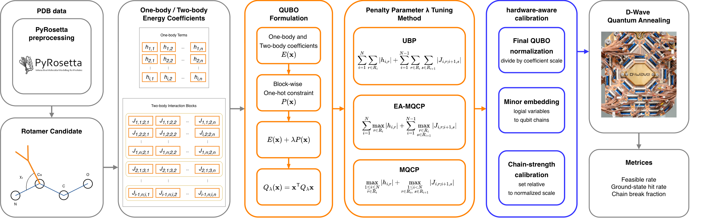

# Quantum Annealing-based Protein Side-Chain Optimization: Penalty Parameter Tuning

Experimental code accompanying the paper, including penalty parameter tuning,
QUBO normalization, chain-strength calibration, and Gurobi reference solutions.

## Abstract

Protein side-chain packing minimizes interaction energy on a fixed backbone by selecting exactly one rotamer per residue. In quantum annealing, enforcing this constraint through penalties makes performance sensitive to both penalty scaling and chain strength. We investigate their joint calibration for side-chain optimization formulated as a quadratic unconstrained binary optimization (QUBO) problem with one-body and adjacent two-body energies and block-wise one-hot penalties. Three static, instance-dependent penalty rules are compared: the upper-bound penalty, energy-aware maximum QUBO coefficient penalty, and maximum QUBO coefficient penalty. Experiments on D-Wave quantum annealers combine penalty sweeps with chain-strength sweeps before and after normalization of the final penalized binary quadratic model. Gurobi solutions provide exact reference optima. Applying the same numerical chain-strength range to unnormalized models yields poor feasibility because coefficient scales differ across penalty rules and instances. Normalization followed by chain-strength calibration substantially improves feasible sampling and reduces chain breaks. Compact penalties can preserve objective resolution in small instances, whereas conservative penalties can provide larger feasibility margins near difficult transitions. However, exact ground-state recovery remains limited for larger instances. These findings highlight the importance of joint, hardware-aware penalty and chain-strength calibration for constrained biomolecular optimization.

## Methodology



*Overview of the protein side-chain optimization workflow.*

## Quick start

Use Python 3.12 and run the following commands from this repository directory:

```bash
python -m venv .venv
source .venv/bin/activate
python -m pip install -r requirements.txt
```

With your own energy tables in `data/` and Ocean credentials configured outside
this repository, run a QPU experiment:

```bash
python run_qa.py --energy-dir data --num-res 2 --num-rot 3 \
  --backend qpu --norm-target 1 --chain-strengths 0.1 0.5 1.0 1.5 2.0 \
  --num-reads 1000 --anneal-time 100
```

The dimensions are illustrative and require matching input tables. QPU execution
requires D-Wave access. Use `python run_qa.py --help` for experiment options.

## Input format

Place these CSV files in `data/`, where N is the number of residues and K is
the number of rotamers per residue:

| Filename | Required header |
| --- | --- |
| `{K}rot_{N}res_one_body_terms.csv` | `res i,rot A_i,E_ii` |
| `{K}rot_{N}res_two_body_terms.csv` | `res i,res j,rot A_i,rot B_j,E_ij` |

Use 1-based indices and finite energies. Include each one-body entry and every
rotamer combination for each forward adjacent residue pair `(i,i+1)` exactly
once, including zero-valued entries. All residues must have the same K.

## Data availability

Research datasets and experimental results are not included. Users must supply
their own one-body and adjacent-residue two-body energy tables. The code reproduces
the experimental procedure; reproducing the paper's numerical results requires
the corresponding input data. Credentials and generated results are excluded
from version control by default.
